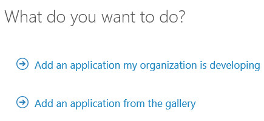
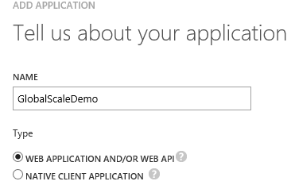
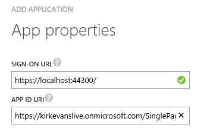
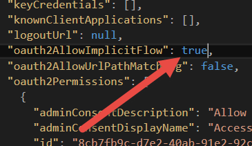
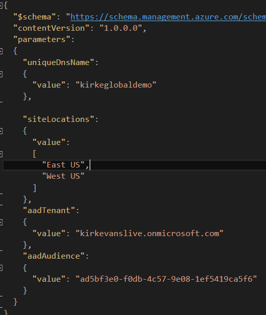
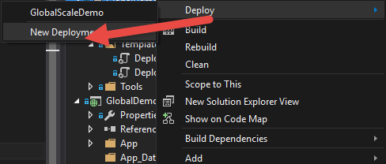
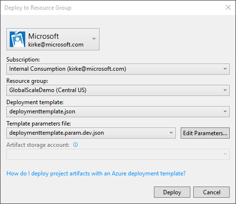
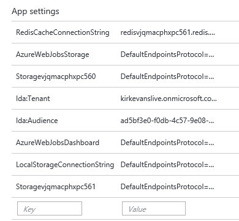
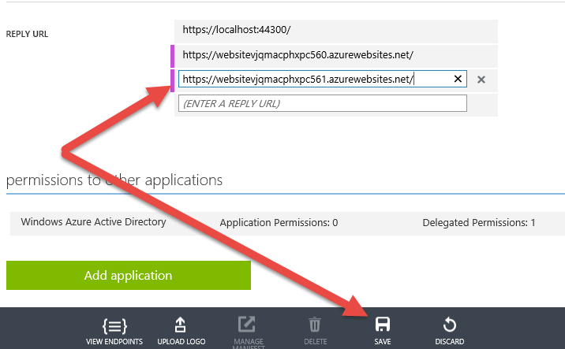

# Scaling Azure Web Apps

This guide provides an introduction to how to scale out (horizontally) using Azure Web Apps and WebJobs.

## Pre-requisites

* Azure subscription
* Azure SDK 2.7 or higher
* Azure Powershell 0.98
  * Azure Powershell 1+ breaks the Powershell script
* Visual Studio 2015
* [Solution code](https://github.com/kaevans/globalscaledemo)

## Setup

*Estimated time: 20 minutes*

1. Go to [manage.windowsazure.com](https://manage.windowsazure.com) and go to the **Active Directory** node.
2. Click the **Add** button in the tray.

  

3. Choose **Add an application my organization is developing**.

  

4. Give the application a name such as GlobalScaleDemo. Leave the default application type as **Web application and/or Web API**.

  

5. For the **Sign-On URL**, enter the base URL for the sample which by default is **https://localhost:44300/**.
6. For the **App ID URI**, enter **https://[Your_Azure_Active_Directory_Tenant_Name]/SinglePageApp-DotNet**, replacing **[Your_Azure_Active_Directory_Tenant_Name]** with the name of your Azure Active Directory tenant.

  

7. While still in the Azure portal, click the **Configure** tab of your Azure Active Directory application.
8. Find the **Client ID** value and copy it to the clipboard.

  
 
  > By default, applications provisioned in Azure Active Directory are not enabled to use the OAuth2 implicit grant. In order to run this demo, you need to follow the instructions below to explicitly opt in.

9. Click the **Manage Manifest** button in the drawer and download the manifest file for the application.
10. Open the manifest file with a text editor and search for the **oauth2AllowImplicitFlow** property. You will find that the property is currently set to **false**. Change the property value to **true** and save the file.

  

11. Click the **Manage Manifest** button once more and upload the updated manifest file. Save the configuration of the application.
12. Open the solution in Visual Studio 2015.
13. Open the **DeploymentTemplate.param.dev.json** file.
14. Update the **aadTenant** parameter with your Azure Active Directory tenant name.
15. Update the **aadAudience** parameter with the Client ID of the Azure Active Directory application that you just registered.
16. Optionally, edit the **siteLocations** array to indicate the regions that you would like to deploy to.

  
  
17. Right-click on the **GlobalDemo.Deploy** project and choose **New Deployment**.

  

18. Specify (or create) a resource group and click **Deploy**. The deployment can take up to 30 minutes due to the long amount of time that is needed to deploy Azure Redis Cache.

  

 > When provisioning is complete, double-check the AppSettings for each web application. There have been cases where the settings were not correctly applied. If this happens, you can try deleting the web application and App Service Plan and running the deployment again. Since the Redis Cache has already been deployed, the second deployment should complete much more quickly.

  

19. Find the URLs for your web applications in the portal. For each web application, add the URL to the Azure Active Directory application as a **Reply URL**, making sure to use **HTTPS** as the protocol and to include a trailing forward slash.

  

 > **Once you have completed the above setup steps, make sure to run the application in every deployed region prior to the demonstration.** The application code will provision the required storage containers and queues when run for the first time.
