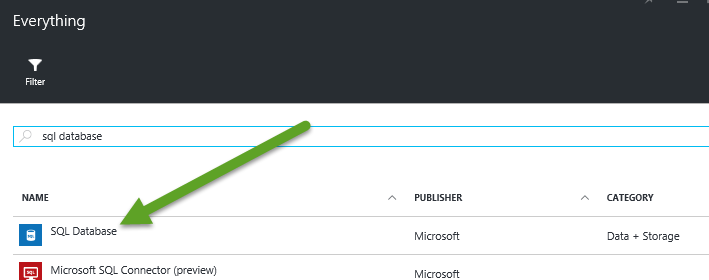
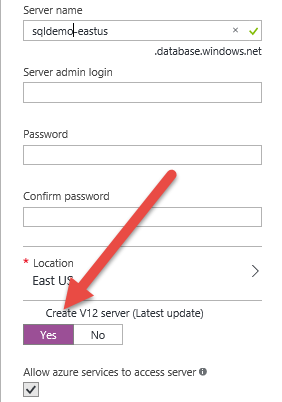
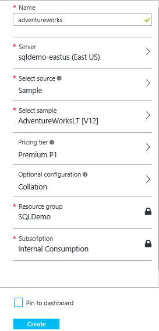
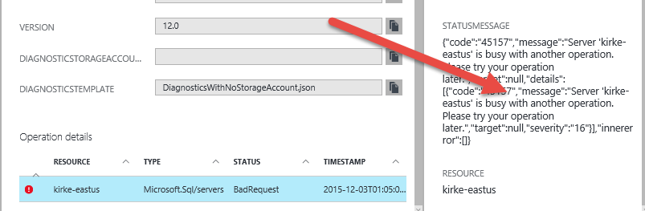
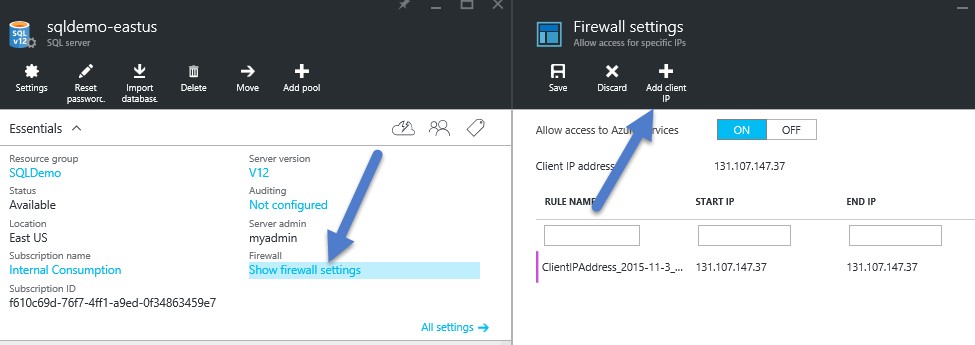

# Azure SQL Database Active Geo-Replication

This guide provides an introduction to Azure SQL Database Active Geo-Replication. In this demo, you will -

* Provision a Basic Azure SQL Database
* Scale the database up to Premium (P1)
* Enable Active Geo-Replication

## Pre-requisites

* Azure subscription
* Azure SDK 2.8 or higher
* Azure Powershell 1.0+
* SQL Server Management Studio

## Setup

*Estimated time: 30 minutes**

1. Go to [portal.azure.com](https://portal.azure.com).
2. Search for **SQL Database** and click to provision a new Azure SQL Server database.

  

3. The database is hosted within a *virtual* Azure SQL database server. Be sure to create a **v12** database server.

  

4. Change the **Source** database to the provided **AdventureWorksLT [V12]** sample database. 
5. Change the **Pricing tier** to **Premium P1**.

  

  > If you encounter an error during provisioning you can click the operation details to examine the error.
  
  
  
6. Once provisioned, add a client firewall rule so you can access your server from your local machine.

  

## Demo steps

1. Go to [portal.azure.com](https://portal.azure.com).
2. Go to the resource group that contains the database that you provisioned during setup.
3. Click on the database **Settings** and click on **Pricing tier (scale DTUs)**.
4. Show that we can change the pricing tier which changes DTUs and backup settings.

  > There is a hidden slide at the end of the deck that covers DTUs. 
  > For more information on DTUs, take a look at [this article](https://azure.microsoft.com/en-us/documentation/articles/sql-database-service-tiers/#understanding-dtus).
  
5. Show the geo-replication is not currently configured.
6. Click on **Configure Geo-Replication**. Choose a target region for the secondary read-only database. Note that the secondary database will be under the same service tier (in this case, Premium (P1)) as the primary database. This is required for active geo-replication.
7. During provisioning, the secondary database status will first indicate **Initializing**, then shortly thereafter **Seeding** as the initial data set is replicated.
8. Explain what is happening to the audience. we created a second, Azure SQL Database server and are replicating our primary database to the secondary region. The first location remains online during the replication. This operation typically takes about 10 minutes.
10. When complete, the secondary region will indicate **Readable** and the diagram will highlight the replication relationship.
11. Go to the readable secondary server and add a client firewall rule so that you can access the secondary database from your local machine.
12. Open **SQL Server Management Studio** and connect to each database using the connection string provided in the portal.
13. Create a new query for each database and arrange the horizontally on the screen so both are visible.
14. Run the following SQL command against the primary database to add an initial record.

    ```sql
    insert into saleslt.customer (NameStyle, Title, FirstName, MiddleName,LastName, Suffix, CompanyName, SalesPerson, EmailAddress, Phone, PasswordHash, PasswordSalt, rowguid, ModifiedDate)
values(0, 'Mr.',  'Kirk',  'A.', 'Evans', NULL, 'GlobalDemo', 'adventure-works\pamela0','orlando0@adventure-works.com','245-555-0173', 'L/Rlwxzp4w7RWmEgXX+/A7cXaePEPcp+KwQhl2fJL7w=','1KjXYs4=', newid(), getdate())
    ```

15. Verify that the record was added to the primary database by running the following SQL query against the primary database.

    ```sql
  select * from saleslt.customer where CompanyName='GlobalDemo' 
    ```

16. Verify that the record was replicated to the secondary database by running the same SQL query against the secondary database.
17. Demonstrate Azure SQL Database using Azure Powershell using the following commands.

    ```powershell
  $database = Get-AzureRMSqlDatabase `
              –DatabaseName "advworks" `
              –ResourceGroupName "sqldemo" `
              –ServerName "kirke-eastus" 

  $database | Set-AzureRMSqlDatabaseSecondary `
              –Failover `
              –PartnerResourceGroupName "sqldemo"
    ```
