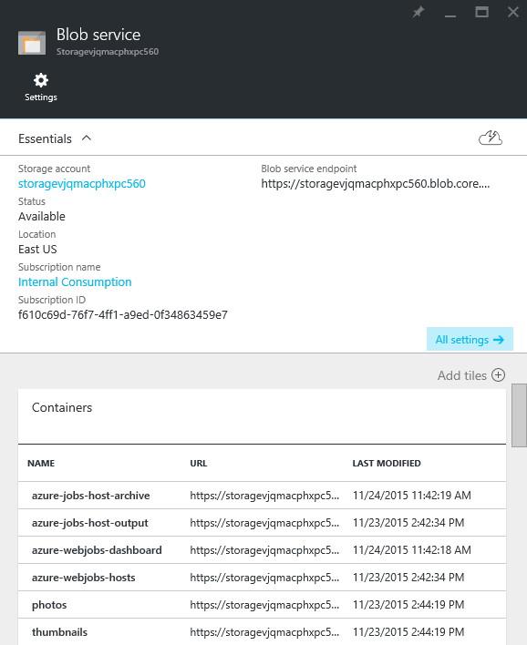

# Global Scale Active/Active Application Deployment

This guide introduces a global scale solutions that provides active/active replication. In this session, you will learn to -

* Deploy a complex solution to multiple regions using Azure Resource Manager (ARM) templates
* Authenticate using Azure Active Directory within an Angular-based Single Page Application (SPA)
* Upload directly to Azure Blob Storage
* Replicate data within a storage account and across storage accounts in different regions

## Pre-requisites

* Azure subscription
* Azure SDK 2.7 or higher
* Azure Powershell 0.98
  * Azure Powershell 1.0+ breaks the Powershell script
* [Solution code](https://github.com/kaevans/globalscaledemo)

## Setup
*Estimated time: 1 hour*

1. Go to [manage.windowsazure.com](https://manage.windowsazure.com) and go to the **Active Directory** node.
2. Click the **Add** button in the tray.

  

3. Choose **Add an application my organization is developing**.

  

4. Give the application a name such as GlobalScaleDemo. Leave the default application type as **Web application and/or Web API**.

  

5. For the **Sign-On URL**, enter the base URL for the sample which by default is **https://localhost:44300/**.
6. For the **App ID URI**, enter **https://[Your_Azure_Active_Directory_Tenant_Name]/SinglePageApp-DotNet**, replacing **[Your_Azure_Active_Directory_Tenant_Name]** with the name of your Azure Active Directory tenant.

  

7. While still in the Azure portal, click the **Configure** tab of your Azure Active Directory application.
8. Find the **Client ID** value and copy it to the clipboard.

  
 
  > By default, applications provisioned in Azure Active Directory are not enabled to use the OAuth2 implicit grant. In order to run this demo, you need to follow the instructions below to explicitly opt in.

9. Click the **Manage Manifest** button in the drawer and download the manifest file for the application.
10. Open the manifest file with a text editor and search for the **oauth2AllowImplicitFlow** property. You will find that the property is currently set to **false**. Change the property value to **true** and save the file.

  

11. Click the **Manage Manifest** button once more and upload the updated manifest file. Save the configuration of the application.
12. Open the solution in Visual Studio 2015.
13. Open the **DeploymentTemplate.param.dev.json** file.
14. Update the **aadTenant** parameter with your Azure Active Directory tenant name.
15. Update the **aadAudience** parameter with the Client ID of the Azure Active Directory application that you just registered.
16. Optionally, edit the **siteLocations** array to indicate the regions that you would like to deploy to.

  
  
17. Right-click on the **GlobalDemo.Deploy** project and choose **New Deployment**.

  

18. Specify (or create) a resource group and click **Deploy**. The deployment can take up to 30 minutes due to the long amount of time that is needed to deploy Azure Redis Cache.

  

 > When provisioning is complete, double-check the AppSettings for each web application. There have been cases where the settings were not correctly applied. If this happens, you can try deleting the web application and App Service Plan and running the deployment again. Since the Redis Cache has already been deployed, the second deployment should complete much more quickly.

  

19. Find the URLs for your web applications in the portal. For each web application, add the URL to the Azure Active Directory application as a **Reply URL**, making sure to use **HTTPS** as the protocol and to include a trailing forward slash.

  

 > **Once you have completed the above setup steps, make sure to run the application in every deployed region prior to the demonstration.** The application code will provision the required storage containers and queues when run for the first time.

# Demo steps
*Estimated time: 8 minutes*

1. Open the [Azure portal](https://portal.azure.com).
2. Go to your the resource group that you previously deployed the application to. Shwo the resources that have been deployed to each region.

  
 
3. Open one of the storage accounts in the portal. Show that it has a queue named **uploadqueue** and multiple blob containers.

  

4. Open one of the web apps in the portal and click **Settings**. 
5. Click on **WebJobs** to show the WebJob monitoring options. 
6. Click on the **Logs** URL for the WebJob to open the Site Control Manager (SCM) and view the WebJob dashboard.

  

7. Click on one of the job runs.
8. Click on **Toggle Output** to show data has been logged directly from the console output.

  

9. Open one of the web sites.
  * **Be sure to use HTTPS**. HTTPS is required by Azure Active Directory in order to correctly process the OAuth token.

  
  

10. Click the **Login** button on the top right corner of the site. Log in using an account from the Azure Active Directory tenant that you used previously to provision the application.

  

11. Once logged in, you can now see the **My Photos** and **Upload** links in the top navigation bar.

  

12. Click the **Upload** link in the top navigation bar and upload a new photo. Show that the photo does not immediately appear in the gallery. The WebJob has to process the photo asynchronously before it will appear in the gallery.
13. Click the **My Photos** link the in the top navigation bar, then click the **Clear All Users Cache** button. This button clears the Redis Cache used to cache today's photos for all users and will force an Azure Table Storage query.

  

14. Click the **Home** link in the top navigation bar. Point out that the time shown is the time required to run a full table scan against our Azure Table Storage table.

  

15. Wait at least 10 seconds before clicking the **Populate** button. This button will cause the next query to come from Redis Cache which will take significantly less time.

  

16. Click the **Populate** button again and show that the time reduces to milliseconds. This is because we are caching the output for 10 seconds using output cache. Under load, cache can have drastic effects. 20,000 requests per second, cached for only one second can save 20,000 requests to the backing store.

  

17. Change the URL to point to the other web site in your resource group. They web apps are ordered sequentially from zero (0) so just change the last number in the URL to one (1).
18. Show that the photo appears in this region as well and show that the storage account name ends with a one (1) while the URL ends with zero (0). The photo originated in region zero and was replicated to the current region asynchronously by our WebJob.

  
