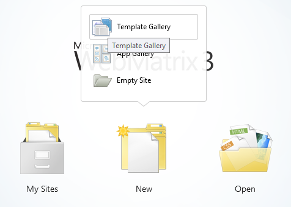
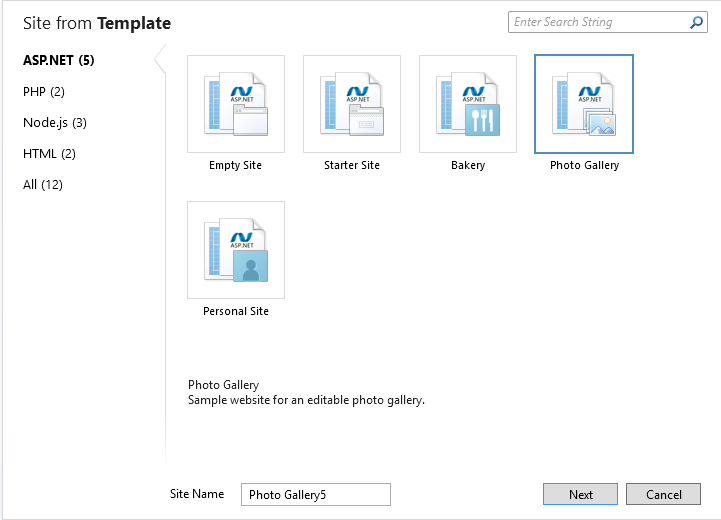
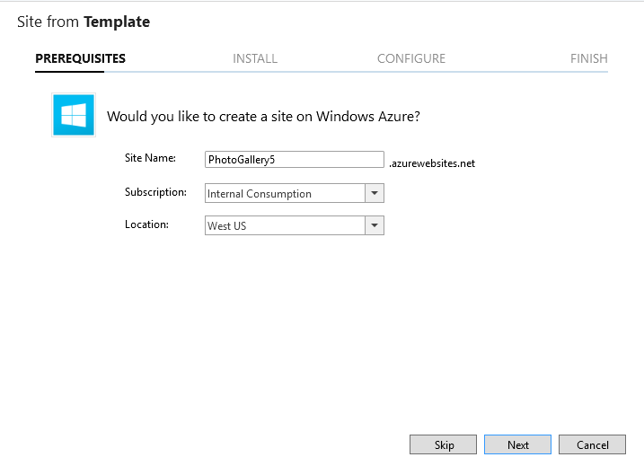
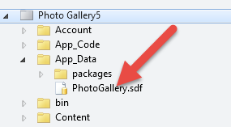

# Original Photo Gallery *(What Not To Do)*
This guide provides an introduction on how not to design Azure Web Apps for global scale.
* Create a new Photo Gallery application using Microsoft WebMatrix
* Highlight the application areas that need to be addressed to achieve global scale

## Pre-requisites
* Microsoft WebMatrix ([available for free through the Microsoft Web Platform Installer](http://go.microsoft.com/fwlink/?LinkID=286266))

## Demo steps
*Estimated time: 8 minutes*

1. Open **WebMatrix** and click **New/Template Gallery**.

2. Choose the **Photo Gallery Template** in the ASP.NET section.

3. Optionally create an Azure Web App and deploy the solution. This enables the audience to play with the application live.

4. Expand the **App_Data** node in the Solution Explorer. Point out that the database is deployed to the web app's file system. All instances of the web app will use the same database file causing significant I/O contention.

5. Open the **Upload.cshtml** file. Scroll to the bottom of the file and show that the photo is being saved directly to the database within the view itself.
6. Open the **View.cshtml** file. Show that the image is retrieved directly from the database every time the page is opened. There is no opportunity for caching here.
7. Click the **Publish** button to publish the app to Azure.
8. Once the publishing is complete, the link to the site will be displayed at the bottom of the page.
9. Click **Login** then click **Register**.
10. Register a new user then login.
11. Point out that this implementation is using Forms-based Authentication. We could have enabled social account login (Facebook, Google, Twitter or Microsoft) or we could have used Azure Active Directory.
12. Click **Create a New Gallery** and upload a picture.
13. Explain that this is the functionality we will implement although the final result will look quite a bit different.

## Clean up
To clean up this environment, simply delete the Azure Web App that was created during the demo.
